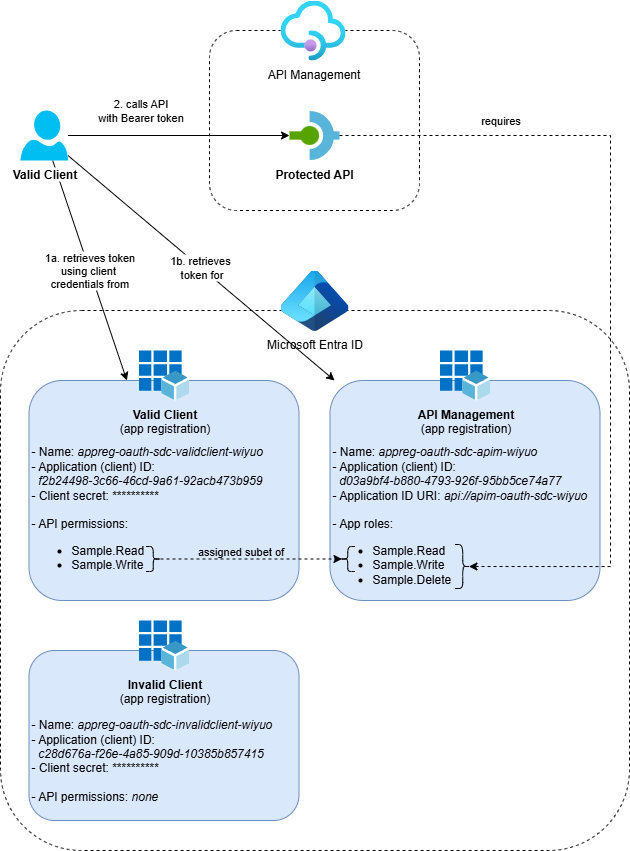

# Protect API Management with OAuth

An Azure Developer CLI (`azd`) template using Bicep to demonstrate how to secure an API in Azure API Management with OAuth. 
It includes examples for deploying app registrations in Entra ID using Bicep.

## Overview

This template deploys the following resources:



The template creates an API Management service with an OAuth-protected API. 
It also deploys three Entra ID app registrations using the [Microsoft Graph Bicep Extension](https://learn.microsoft.com/en-us/community/content/microsoft-graph-bicep-extension): one app registration that represents the APIs in API Management, one client with 'read' and 'write' permissions and one client with no API access (for testing authorization failures).

Additionally, Application Insights and Log Analytics Workspace are deployed for monitoring and logging purposes. 
A Key Vault is also included to securely store client secrets for integration tests.

Want to learn more about how this template works? Check out the accompanying blog post [Protect APIs in Azure API Management with OAuth](https://ronaldbosma.github.io/blog/2025/09/16/protect-apis-in-azure-api-management-with-oauth/).

If you want to learn more about calling OAuth-Protected APIs from or on Azure API Management, check out the following resources:
- [Call API Management with Managed Identity](https://github.com/ronaldbosma/call-apim-with-managed-identity)
- [Call API Management backend with OAuth](https://github.com/ronaldbosma/call-apim-backend-with-oauth)

> [!IMPORTANT]  
> This template is not production-ready; it uses minimal cost SKUs and omits network isolation, advanced security, governance and resiliency. Harden security, implement enterprise controls and/or replace modules with [Azure Verified Modules](https://azure.github.io/Azure-Verified-Modules/) before any production use.

## Getting Started

### Prerequisites  

Before you can deploy this template, make sure you have the following tools installed and the necessary permissions.

**Required Tools:**
- [Azure Developer CLI (azd)](https://learn.microsoft.com/en-us/azure/developer/azure-developer-cli/install-azd)  
  Installing `azd` also installs the following tools:  
  - [GitHub CLI](https://cli.github.com)  
  - [Bicep CLI](https://learn.microsoft.com/en-us/azure/azure-resource-manager/bicep/install)  
- This template includes several hooks that run at different stages of the deployment process and require the following tools. For more details, see [Hooks](#hooks).
  - [PowerShell](https://learn.microsoft.com/en-us/powershell/scripting/install/installing-powershell)
  - [Azure CLI](https://learn.microsoft.com/en-us/cli/azure/install-azure-cli?view=azure-cli-latest)

**Required Permissions:**
- You need **Owner** permissions, or a combination of **Contributor** and **Role Based Access Control Administrator** permissions on an Azure Subscription to deploy this template.
- You need **Application Administrator** or **Cloud Application Administrator** permissions to register the Entra ID app registrations. 
  _(You already have enough permissions if 'Users can register applications' is enabled in your Entra tenant.)_

**Optional Prerequisites:**

To build and run the [integration tests](#integration-tests) locally, you need the following additional tools:
- [.NET 10 SDK](https://dotnet.microsoft.com/en-us/download/dotnet/10.0)  

### Deployment

Once the prerequisites are installed on your machine, you can deploy this template using the following steps:

1. Run the `azd init` command in an empty directory with the `--template` parameter to clone this template into the current directory.  

    ```cmd
    azd init --template ronaldbosma/protect-apim-with-oauth
    ```

    When prompted, specify the name of the environment, for example, `oauth`. The maximum length is 32 characters.

1. Run the `azd auth login` command to authenticate to your Azure subscription using the **Azure Developer CLI** _(if you haven't already)_.

    ```cmd
    azd auth login
    ```

1. Run the `az login` command to authenticate to your Azure subscription using the **Azure CLI** _(if you haven't already)_. This is required for the [hooks](#hooks) to function properly. Make sure to log into the same tenant as the Azure Developer CLI.

    ```cmd
    az login
    ```

1. Run the `azd up` command to provision the resources in your Azure subscription and Entra ID tenant. This deployment typically takes around 4 minutes to complete.

    ```cmd
    azd up
    ```

    See [Troubleshooting](#troubleshooting) if you encounter any issues during deployment.

1. Once the deployment is complete, you can locally modify the application or infrastructure and run `azd up` again to update the resources in Azure.

### Demo and Test

The [Demo Guide](demos/demo.md) provides a step-by-step walkthrough on how to test and demonstrate the deployed resources.

### Clean up

Once you're done and want to clean up, run the `azd down` command. By including the `--purge` parameter, you ensure that the API Management service and Log Analytics workspace don't remain in a soft-deleted state, which could cause issues with future deployments of the same environment.

```cmd
azd down --purge
```


## Contents

The repository consists of the following files and directories:

```
├── .github                    
│   └── workflows              [ GitHub Actions workflow(s) ]
├── demos                      [ Demo guide(s) ]
├── hooks                      [ AZD Hooks to execute at different stages of the deployment process ]
├── images                     [ Images used in the README and demo guide ]
├── infra                      [ Infrastructure As Code files ]
│   |── functions              [ Bicep user-defined functions ]
│   ├── modules                
│   │   ├── application        [ The protected API ]
│   │   ├── entra-id           [ Modules for all Entra ID resources ]
│   │   ├── services           [ Modules for all Azure services ]
│   │   └── shared             [ Shared Bicep modules ]
│   ├── types                  [ Bicep user-defined types ]
│   ├── main.bicep             [ Main infrastructure file ]
│   └── main.parameters.json   [ Parameters file ]
├── tests                      
│   ├── IntegrationTests       [ Integration tests for automatically verifying different scenarios ]
│   └── tests.http             [ HTTP requests to test the deployed resources ]
├── azure.yaml                 [ Describes the apps and types of Azure resources ]
└── bicepconfig.json           [ Bicep configuration file ]
```


## Hooks

This template has several hooks that are executed at different stages of the deployment process. The following hooks are included:

### Post-provision hooks

These PowerShell scripts are executed after the infrastructure resources are provisioned.

- [postprovision-create-and-store-client-secrets.ps1](hooks/postprovision-create-and-store-client-secrets.ps1): 
  Currently, we can't create secrets for an app registration with Bicep.
  This script creates a client secret for each client app registrations in Entra ID and stores it securely in Azure Key Vault. 
  If the secret for a client already exists in Key Vault, it won't create a new one.

### Pre-down hooks

These PowerShell scripts are executed before the resources are removed.

- [predown-remove-app-registrations.ps1](hooks/predown-remove-app-registrations.ps1): 
  Removes the app registrations created during the deployment process, because `azd` doesn't support deleting Entra ID resources yet. 
  See the related GitHub issue: https://github.com/Azure/azure-dev/issues/4724. 
  The Entra ID resources have a custom tag `azd-env-id: <environment-id>`, so we can find and delete them.


## Pipeline

This template includes a GitHub Actions workflow that automates the build, deployment and cleanup process. The workflow is defined in [azure-dev.yml](.github/workflows/azure-dev.yml) and provides a complete CI/CD pipeline for this template using the Azure Developer CLI.


The pipeline consists of the following jobs:

- **Build, Verify and Package**: This job sets up the build environment, validates the Bicep template and packages the integration tests.
- **Deploy to Azure**: This job provisions the Azure infrastructure and deploys the packaged applications to the created resources.
- **Execute Integration Tests**: This job runs automated [integration tests](#integration-tests) on the deployed resources to verify correct functionality.
- **Clean Up Resources**: This job removes all deployed Azure resources.  

  By default, cleanup runs automatically after the deployment. This can be disabled via an input parameter when the workflow is triggered manually.

  

### Setting Up the Pipeline

To set up the pipeline in your own repository, run the following command (add ` --provider azdo` if you want to create an Azure DevOps pipeline):

```cmd
azd pipeline config
```

Follow the instructions and choose **Federated Service Principal (SP + OIDC)**, as OpenID Connect (OIDC) is the authentication method used by the pipeline, and only a **service principal** can be granted the necessary permissions in Entra ID.

After the service principal has been created:
- Add the Microsoft Graph permissions **Application.ReadWrite.All** and **AppRoleAssignment.ReadWrite.All** to the app registration of the service principal, and grant admin consent for these permissions. Use the **application permissions** type, not delegated permissions type. These permissions are necessary to deploy the Entra ID resources with the Microsoft Graph Bicep Extension.
- Assign the service principal either the **Application Administrator** or **Cloud Application Administrator** role if it's not already assigned. One of these roles is necessary for the [hooks](#hooks) to successfully remove the Entra ID resources during cleanup.

For detailed guidance, refer to:
- [Explore Azure Developer CLI support for CI/CD pipelines](https://learn.microsoft.com/en-us/azure/developer/azure-developer-cli/configure-devops-pipeline)
- [Create a GitHub Actions CI/CD pipeline using the Azure Developer CLI](https://learn.microsoft.com/en-us/azure/developer/azure-developer-cli/pipeline-github-actions)  

> [!TIP]
> By default, `AZURE_CLIENT_ID`, `AZURE_TENANT_ID` and `AZURE_SUBSCRIPTION_ID` are created as variables in GitHub when running `azd pipeline config`. However, [Microsoft recommends](https://learn.microsoft.com/en-us/azure/developer/github/connect-from-azure-openid-connect) using secrets for these values to avoid exposing them in logs. The workflow supports both approaches, so you can manually create secrets and remove the variables if desired.

> [!NOTE]
> In the GitHub Actions workflow, the environment name in the `AZURE_ENV_NAME` variable is suffixed with `-pr{id}` for pull requests. This prevents conflicts when multiple PRs are open and avoids accidental removal of environments, because the environment name tag is used when removing resources.


## Integration Tests

The project includes integration tests built with **.NET 10** that validate various scenarios through the deployed Azure services. 
The tests implement the same scenarios described in the [Demo](./demos/demo.md) and are located in [ClientTests.cs](tests/IntegrationTests/ClientTests.cs).
They automatically locate your azd environment's `.env` file if available, to retrieve necessary configuration. In the [pipeline](#pipeline) they rely on environment variables set in the workflow.


## Troubleshooting

### API Management deployment failed because the service already exists in soft-deleted state

If you've previously deployed this template and deleted the resources, you may encounter the following error when redeploying the template. This error occurs because the API Management service is in a soft-deleted state and needs to be purged before you can create a new service with the same name.

```json
{
    "code": "DeploymentFailed",
    "target": "/subscriptions/00000000-0000-0000-0000-000000000000/resourceGroups/rg-oauth-sdc-wiyuo/providers/Microsoft.Resources/deployments/apiManagement",
    "message": "At least one resource deployment operation failed. Please list deployment operations for details. Please see https://aka.ms/arm-deployment-operations for usage details.",
    "details": [
        {
            "code": "ServiceAlreadyExistsInSoftDeletedState",
            "message": "Api service apim-oauth-sdc-wiyuo was soft-deleted. In order to create the new service with the same name, you have to either undelete the service or purge it. See https://aka.ms/apimsoftdelete."
        }
    ]
}
```

Use the [az apim deletedservice list](https://learn.microsoft.com/en-us/cli/azure/apim/deletedservice?view=azure-cli-latest#az-apim-deletedservice-list) Azure CLI command to list all deleted API Management services in your subscription. Locate the service that is in a soft-deleted state and purge it using the [purge](https://learn.microsoft.com/en-us/cli/azure/apim/deletedservice?view=azure-cli-latest#az-apim-deletedservice-purge) command. See the following example:

```cmd
az apim deletedservice purge --location "swedencentral" --service-name "apim-oauth-sdc-wiyuo"
```

### Deployment fails with BadRequest: ServiceManagementReference field is required for Update, but is missing in the request

In an enterprise environment (for tenants with Entra IDs enabled by Service Tree management), the `ServiceManagementReference` field on an application (app registration) is mandatory.
If you're deploying this template in such an environment, you may encounter the following error during deployment:

```
ERROR: error executing step command 'provision': deployment failed: error deploying infrastructure: deploying to subscription:

Deployment Error Details:
BadRequest: ServiceManagementReference field is required for Update, but is missing in the request. 
Refer to the TSG `https://aka.ms/service-management-reference-error` for resolving the error 
Graph client request id: <request-id>. 
Graph request time: 2025-11-20T12:34:56.789Z.

TraceID: <trace-id>
```

This template provides an optional parameter to set the `ServiceManagementReference` field on app registrations if required by your tenant.
Use the following command to set the `AZURE_SERVICE_MANAGEMENT_REFERENCE` environment variable in your azd environment:

```cmd
azd env set AZURE_SERVICE_MANAGEMENT_REFERENCE <id>
```

Replace `<id>` with the valid Service Tree ID. 
If you don't provide a valid ID, the deployment will fail with the following error: `Value for ServiceManagementReference must be a valid GUID`.

